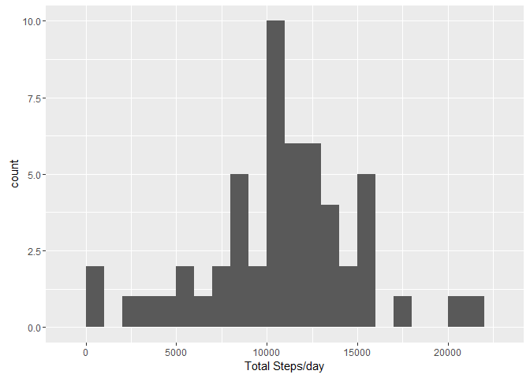
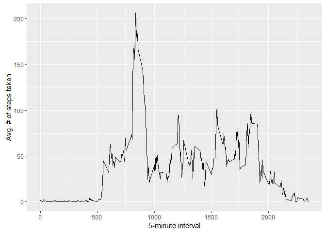
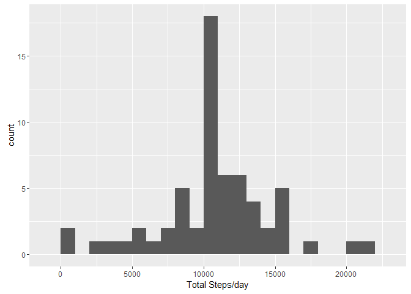

**Coursera Course : Reproducable Research- Project 1.**
-------------------------------------------------------

### Loading and preprocessing the data

    unzip(zipfile="activity.zip")
    rawdata <- read.csv("activity.csv")

### What is mean total number of steps taken per day?

    #Aggregate for daily totals
    attach(rawdata)
    daily<- aggregate(steps,by=list(date),FUN=sum)
    detach(rawdata)
    names(daily)<-c("day","steps")
    #Plot a Histogram
    library(ggplot2)

    ## Warning: package 'ggplot2' was built under R version 3.2.3

    qplot(daily$steps, binwidth = 1000, xlab = "Total Steps/day")

    ## Warning: Removed 8 rows containing non-finite values (stat_bin).

<!-- -->

    #Calculate Mean and Medians
    mean(daily$steps,na.rm = TRUE)

    ## [1] 10766.19

    median(daily$steps,na.rm = TRUE)

    ## [1] 10765

### What is the average daily activity pattern?

    #Average across days per interval
    attach(rawdata)
    intervals<-aggregate(steps,by=list(interval),mean,na.rm=TRUE)
    detach(rawdata)
    names(intervals)<-c("Interval","Avgsteps")
    #Plotting a line chart
    ggplot(data = intervals, aes(x = Interval, y = Avgsteps)) + geom_line() + xlab("5-minute interval") + 
      ylab("Avg. # of steps taken")

<!-- -->

    # Which Internval has maximum Value 
    intervals[which.max(intervals$Avgsteps), ]

    ##     Interval Avgsteps
    ## 104      835 206.1698

### Imputing missing values

    # Missing Values
    missing <- sum(is.na(rawdata$steps))
    missing

    ## [1] 2304

    #Replacing NA values from the Intervals data frame(which contains Interval means) .
    impute <- function(steps, interval) {
      filled <- NA
      if (!is.na(steps)) 
        filled <- c(steps) else filled <- (intervals[intervals$interval == interval, "steps"])
        return(filled)
    }
    names(intervals)<-c("interval","steps")
    rawdata_filled<-rawdata
    rawdata_filled$steps<-mapply(impute,rawdata_filled$steps,rawdata_filled$interval)
    #Making a Histogram on the new data frame
    attach(rawdata_filled)
    daily_filled<- aggregate(steps,by=list(date),FUN=sum)
    detach(rawdata_filled)
    names(daily_filled)<-c("day","steps")
    qplot(daily_filled$steps, binwidth = 1000, xlab = "Total Steps/day")

<!-- -->

    #Calculate Mean and Medians
    mean(daily_filled$steps,na.rm = TRUE)

    ## [1] 10766.19

    median(daily_filled$steps,na.rm = TRUE)

    ## [1] 10766.19

### Are there differences in activity patterns between weekdays and weekends?

    #Determine Weekend or Weekday
    wday<- function(date)
      {
      library(chron)
      if (is.weekend(date))
      return ("weekend")
    else 
      return ("weekday")
    }

    rawdata_filled$date <-as.Date(rawdata_filled$date)
    rawdata_filled$day<- sapply(rawdata_filled$date,FUN = wday)

    ## Warning: package 'chron' was built under R version 3.2.2

    #Plotting Intervals between Weekend and weekday.More rest on weekend :)
    averages <- aggregate(steps ~ interval + day, data = rawdata_filled, mean)
    ggplot(averages, aes(interval, steps)) + geom_line() + facet_grid(day ~ .) + 
      xlab("5-minute interval") + ylab("Number of steps")

<!-- -->
